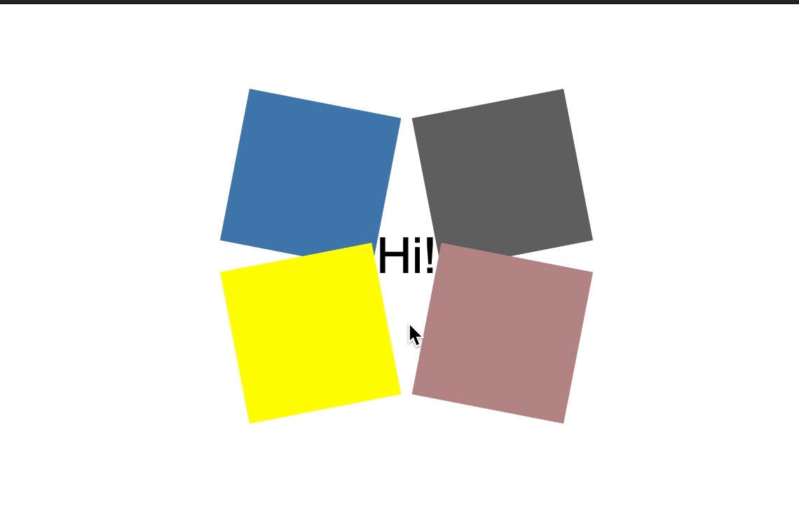

# Secret Unfolds - CSS-Animation

## Exercise Course-Module 1 - UserInterfaceBasics (UIB) - HTML/CSS

Created an animation oriented to the reference gif below; using `transform`, `relative` and `absolute` positioning & `transition-delay`

31.10.22
